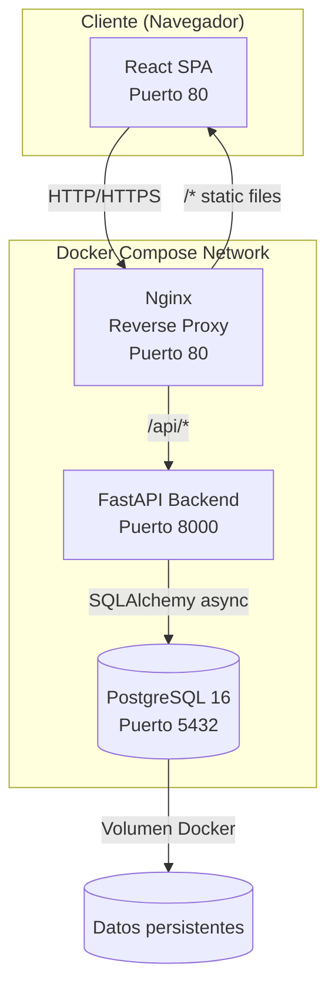
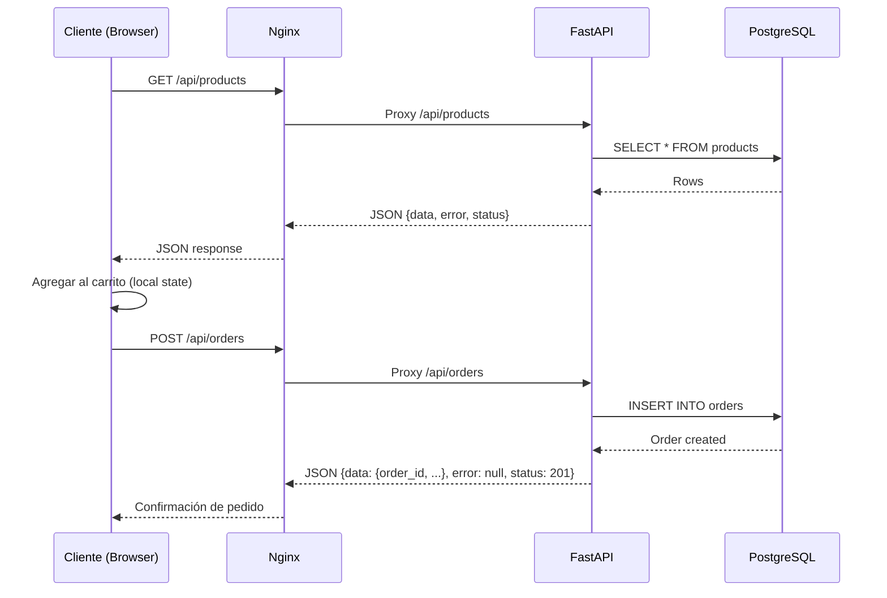
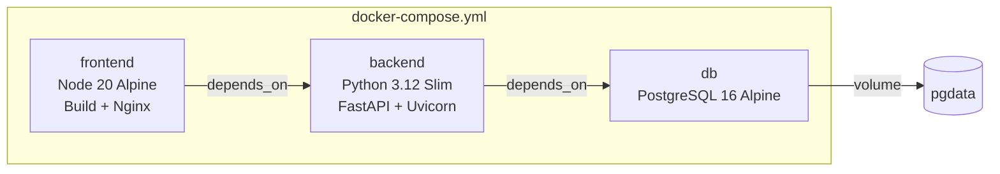
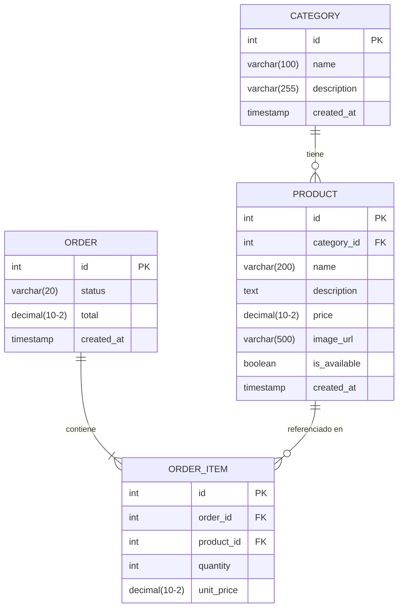
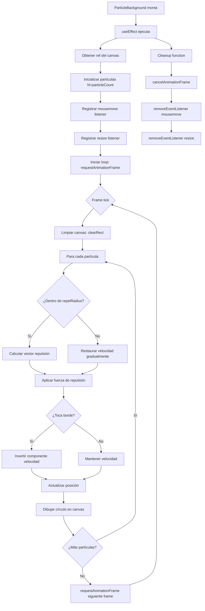

# Documento de Diseño Técnico
## Food Business Web App

---

## Resumen de Investigación

Antes de definir la arquitectura, se investigaron las siguientes áreas:

- **Stack backend**: FastAPI (Python) es la opción más adecuada para este proyecto. Es el framework Python más popular para APIs REST en 2024-2025, con soporte nativo para async/await, validación automática con Pydantic, documentación OpenAPI integrada y excelente integración con SQLAlchemy + PostgreSQL. El template oficial `fastapi/full-stack-fastapi-template` usa exactamente este stack (FastAPI + React + PostgreSQL + Docker).
- **Base de datos**: PostgreSQL 16 en Docker es la elección estándar para aplicaciones relacionales. Es robusta, soporta JSON nativo, y tiene excelente soporte en Docker con imágenes oficiales.
- **ORM**: SQLAlchemy 2.0 con modo async para operaciones no bloqueantes, junto con Alembic para migraciones.
- **Arquitectura React**: Feature-Based Architecture (FBA) es el estándar actual para proyectos React escalables. Agrupa archivos por funcionalidad en lugar de por tipo técnico.
- **Canvas API**: La Canvas API de HTML5 con `requestAnimationFrame` es la solución nativa para animaciones 2D de alto rendimiento sin dependencias externas.

**Fuentes consultadas:**
- [FastAPI Full Stack Template](https://github.com/fastapi/full-stack-fastapi-template) — template oficial FastAPI + React + PostgreSQL
- [Bulletproof React](https://github.com/alan2207/bulletproof-react) — arquitectura escalable para React
- [Mastering Modern React + Vite Folder Structure](https://sandeshrathnayake.medium.com/mastering-modern-react-vite-folder-structure-a-production-ready-guide-for-scalable-applications-9ad8e233f8b9)

---

## Visión General

La aplicación web de negocio de comida es una SPA (Single Page Application) orientada exclusivamente al cliente final. Permite explorar el menú, gestionar un carrito de compras y realizar pedidos en línea. El diseño prioriza la experiencia visual con un fondo animado interactivo (`ParticleBackground`), una paleta de colores formal y un diseño completamente responsivo.

### Decisiones de Diseño Clave

| Decisión | Elección | Justificación |
|---|---|---|
| Frontend framework | React 18 + Vite 5 | Ecosistema maduro, HMR rápido, soporte JSX nativo |
| Backend framework | FastAPI (Python 3.12) | Async nativo, validación automática, OpenAPI integrado |
| Base de datos | PostgreSQL 16 | Relacional, robusta, excelente soporte Docker |
| ORM | SQLAlchemy 2.0 async | Queries async, type-safe, migraciones con Alembic |
| Estado del carrito | React Context + useReducer | Sin dependencias externas, suficiente para este scope |
| HTTP client | Axios | Interceptores, manejo de errores centralizado |
| Animaciones | Canvas API nativa | Sin librerías externas, control total, rendimiento óptimo |
| Contenedores | Docker Compose | Orquestación simple, reproducible en cualquier entorno |

---

## Arquitectura

### Diagrama de Alto Nivel



### Flujo de Datos



### Arquitectura de Servicios Docker



---

## Componentes e Interfaces

### Estructura del Proyecto Frontend

```
frontend/
├── public/
│   └── placeholder-food.webp
├── src/
│   ├── assets/
│   │   └── fonts/
│   ├── components/
│   │   ├── ui/                        # Componentes atómicos reutilizables
│   │   │   ├── Button/
│   │   │   │   ├── Button.jsx
│   │   │   │   └── Button.module.css
│   │   │   ├── Badge/
│   │   │   ├── Spinner/
│   │   │   ├── Modal/
│   │   │   └── EmptyState/
│   │   ├── layout/                    # Componentes de estructura
│   │   │   ├── Navbar/
│   │   │   │   ├── Navbar.jsx
│   │   │   │   └── Navbar.module.css
│   │   │   └── Footer/
│   │   └── ParticleBackground/        # Componente especial de animación
│   │       ├── ParticleBackground.jsx
│   │       └── ParticleBackground.module.css
│   ├── features/                      # Feature-Based Architecture
│   │   ├── menu/
│   │   │   ├── components/
│   │   │   │   ├── MenuPage.jsx
│   │   │   │   ├── CategoryFilter.jsx
│   │   │   │   ├── ProductGrid.jsx
│   │   │   │   ├── ProductCard.jsx
│   │   │   │   └── ProductDetailModal.jsx
│   │   │   ├── hooks/
│   │   │   │   └── useMenu.js
│   │   │   └── services/
│   │   │       └── menuService.js
│   │   ├── cart/
│   │   │   ├── components/
│   │   │   │   ├── CartDrawer.jsx
│   │   │   │   ├── CartItem.jsx
│   │   │   │   └── CartSummary.jsx
│   │   │   ├── context/
│   │   │   │   └── CartContext.jsx
│   │   │   └── hooks/
│   │   │       └── useCart.js
│   │   └── orders/
│   │       ├── components/
│   │       │   ├── CheckoutPage.jsx
│   │       │   └── OrderConfirmation.jsx
│   │       ├── hooks/
│   │       │   └── useOrder.js
│   │       └── services/
│   │           └── orderService.js
│   ├── hooks/                         # Hooks globales compartidos
│   │   └── useAsync.js
│   ├── services/                      # Configuración HTTP global
│   │   └── api.js
│   ├── styles/                        # Estilos globales y tokens de diseño
│   │   ├── globals.css
│   │   ├── tokens.css
│   │   └── reset.css
│   ├── utils/
│   │   ├── formatCurrency.js
│   │   └── contrastRatio.js
│   ├── App.jsx
│   └── main.jsx
├── index.html
├── vite.config.js
└── package.json
```

### Estructura del Proyecto Backend

```
backend/
├── app/
│   ├── api/
│   │   ├── v1/
│   │   │   ├── endpoints/
│   │   │   │   ├── products.py
│   │   │   │   ├── categories.py
│   │   │   │   └── orders.py
│   │   │   └── router.py
│   │   └── deps.py
│   ├── core/
│   │   ├── config.py          # Settings desde variables de entorno
│   │   └── database.py        # Engine async SQLAlchemy
│   ├── models/                # Modelos SQLAlchemy (ORM)
│   │   ├── product.py
│   │   ├── category.py
│   │   └── order.py
│   ├── schemas/               # Schemas Pydantic (validación/serialización)
│   │   ├── product.py
│   │   ├── category.py
│   │   └── order.py
│   ├── crud/                  # Operaciones de base de datos
│   │   ├── product.py
│   │   ├── category.py
│   │   └── order.py
│   └── main.py
├── alembic/
│   └── versions/
├── alembic.ini
├── requirements.txt
└── Dockerfile
```

### Interfaces de Componentes React Clave

#### ParticleBackground

```jsx
// Props interface
ParticleBackground.propTypes = {
  particleCount: PropTypes.number,   // default: 80
  particleColor: PropTypes.string,   // default: 'rgba(255, 160, 80, 0.6)'
  repelRadius: PropTypes.number,     // default: 120 (px)
  baseSpeed: PropTypes.number,       // default: 0.8
}
```

#### CartContext

```jsx
// Valor del contexto
{
  items: CartItem[],           // Lista de productos en el carrito
  addItem: (product) => void,  // Agrega o incrementa cantidad
  removeItem: (id) => void,    // Elimina producto del carrito
  updateQuantity: (id, qty) => void, // Actualiza cantidad (0 = eliminar)
  clearCart: () => void,       // Vacía el carrito
  totalItems: number,          // Suma de todas las cantidades
  subtotal: number,            // Suma de price * quantity
}
```

### Endpoints de la API REST

| Método | Ruta | Descripción |
|---|---|---|
| GET | /api/v1/categories | Listar todas las categorías |
| GET | /api/v1/products | Listar todos los productos |
| GET | /api/v1/products?category_id={id} | Filtrar productos por categoría |
| GET | /api/v1/products/{id} | Detalle de un producto |
| POST | /api/v1/orders | Crear un nuevo pedido |
| GET | /api/v1/orders/{id} | Consultar estado de un pedido |

**Estructura de respuesta estándar:**

```json
{
  "data": { ... } | null,
  "error": null | "Mensaje de error",
  "status": 200
}
```

---

## Modelos de Datos

### Diagrama Entidad-Relación



### Modelos SQLAlchemy

```python
# models/category.py
class Category(Base):
    __tablename__ = "categories"
    id: Mapped[int] = mapped_column(primary_key=True)
    name: Mapped[str] = mapped_column(String(100), nullable=False)
    description: Mapped[str | None] = mapped_column(String(255))
    created_at: Mapped[datetime] = mapped_column(default=func.now())
    products: Mapped[list["Product"]] = relationship(back_populates="category")

# models/product.py
class Product(Base):
    __tablename__ = "products"
    id: Mapped[int] = mapped_column(primary_key=True)
    category_id: Mapped[int] = mapped_column(ForeignKey("categories.id"))
    name: Mapped[str] = mapped_column(String(200), nullable=False)
    description: Mapped[str | None] = mapped_column(Text)
    price: Mapped[Decimal] = mapped_column(Numeric(10, 2), nullable=False)
    image_url: Mapped[str | None] = mapped_column(String(500))
    is_available: Mapped[bool] = mapped_column(default=True)
    created_at: Mapped[datetime] = mapped_column(default=func.now())
    category: Mapped["Category"] = relationship(back_populates="products")

# models/order.py
class Order(Base):
    __tablename__ = "orders"
    id: Mapped[int] = mapped_column(primary_key=True)
    status: Mapped[str] = mapped_column(String(20), default="Pendiente")
    total: Mapped[Decimal] = mapped_column(Numeric(10, 2), nullable=False)
    created_at: Mapped[datetime] = mapped_column(default=func.now())
    items: Mapped[list["OrderItem"]] = relationship(back_populates="order")

class OrderItem(Base):
    __tablename__ = "order_items"
    id: Mapped[int] = mapped_column(primary_key=True)
    order_id: Mapped[int] = mapped_column(ForeignKey("orders.id"))
    product_id: Mapped[int] = mapped_column(ForeignKey("products.id"))
    quantity: Mapped[int] = mapped_column(nullable=False)
    unit_price: Mapped[Decimal] = mapped_column(Numeric(10, 2), nullable=False)
    order: Mapped["Order"] = relationship(back_populates="items")
    product: Mapped["Product"] = relationship()
```

### Schemas Pydantic

```python
# schemas/product.py
class ProductBase(BaseModel):
    name: str = Field(..., max_length=200)
    description: str | None = None
    price: Decimal = Field(..., gt=0, decimal_places=2)
    image_url: str | None = None
    is_available: bool = True

class ProductRead(ProductBase):
    id: int
    category_id: int
    created_at: datetime
    model_config = ConfigDict(from_attributes=True)

# schemas/order.py
class OrderItemCreate(BaseModel):
    product_id: int
    quantity: int = Field(..., gt=0)

class OrderCreate(BaseModel):
    items: list[OrderItemCreate] = Field(..., min_length=1)

class OrderRead(BaseModel):
    id: int
    status: str
    total: Decimal
    created_at: datetime
    items: list[OrderItemRead]
    model_config = ConfigDict(from_attributes=True)
```

### Tokens de Diseño (CSS Custom Properties)

```css
/* styles/tokens.css */
:root {
  /* Paleta de colores formal */
  --color-primary-900: #1a1a2e;   /* Fondo oscuro principal */
  --color-primary-800: #16213e;   /* Fondo oscuro secundario */
  --color-primary-700: #0f3460;   /* Fondo oscuro terciario */

  --color-accent-500: #e94560;    /* Acento cálido principal */
  --color-accent-400: #ff6b6b;    /* Acento cálido hover */
  --color-accent-300: #ffa07a;    /* Acento cálido suave */

  --color-neutral-100: #f8f9fa;   /* Fondo claro principal */
  --color-neutral-200: #e9ecef;   /* Fondo claro secundario */
  --color-neutral-300: #dee2e6;   /* Bordes */
  --color-neutral-600: #6c757d;   /* Texto secundario */
  --color-neutral-900: #212529;   /* Texto principal */

  --color-white: #ffffff;
  --color-success: #28a745;
  --color-error: #dc3545;

  /* Tipografía */
  --font-family-base: 'Inter', 'Segoe UI', system-ui, sans-serif;
  --font-size-xs: 0.75rem;    /* 12px */
  --font-size-sm: 0.875rem;   /* 14px */
  --font-size-base: 1rem;     /* 16px */
  --font-size-lg: 1.25rem;    /* 20px */
  --font-size-xl: 1.5rem;     /* 24px */
  --font-size-2xl: 2rem;      /* 32px */
  --font-size-3xl: 2.5rem;    /* 40px */

  --font-weight-normal: 400;
  --font-weight-medium: 500;
  --font-weight-semibold: 600;
  --font-weight-bold: 700;

  /* Espaciado */
  --spacing-1: 0.25rem;
  --spacing-2: 0.5rem;
  --spacing-3: 0.75rem;
  --spacing-4: 1rem;
  --spacing-6: 1.5rem;
  --spacing-8: 2rem;
  --spacing-12: 3rem;
  --spacing-16: 4rem;

  /* Bordes */
  --border-radius-sm: 4px;
  --border-radius-md: 8px;
  --border-radius-lg: 16px;
  --border-radius-full: 9999px;

  /* Sombras */
  --shadow-sm: 0 1px 3px rgba(0,0,0,0.12);
  --shadow-md: 0 4px 6px rgba(0,0,0,0.15);
  --shadow-lg: 0 10px 25px rgba(0,0,0,0.2);

  /* Transiciones */
  --transition-fast: 150ms ease-in-out;
  --transition-base: 250ms ease-in-out;
  --transition-slow: 300ms ease-in-out;

  /* Breakpoints (referencia para JS) */
  --breakpoint-sm: 320px;
  --breakpoint-md: 768px;
  --breakpoint-lg: 1024px;
  --breakpoint-xl: 1440px;
  --breakpoint-2xl: 1920px;
}
```

---

## Diseño Detallado del Componente ParticleBackground

### Estructura Interna



### Implementación de Referencia

```jsx
// components/ParticleBackground/ParticleBackground.jsx
import { useEffect, useRef } from 'react'
import styles from './ParticleBackground.module.css'

const DEFAULT_PARTICLE_COUNT = 80
const DEFAULT_PARTICLE_COLOR = 'rgba(255, 160, 80, 0.6)'
const DEFAULT_REPEL_RADIUS = 120
const DEFAULT_BASE_SPEED = 0.8

function createParticle(canvasWidth, canvasHeight, baseSpeed) {
  const angle = Math.random() * Math.PI * 2
  const speed = (Math.random() * 0.5 + 0.5) * baseSpeed
  return {
    x: Math.random() * canvasWidth,
    y: Math.random() * canvasHeight,
    vx: Math.cos(angle) * speed,
    vy: Math.sin(angle) * speed,
    originalVx: Math.cos(angle) * speed,
    originalVy: Math.sin(angle) * speed,
    radius: Math.random() * 2 + 1.5,
    opacity: Math.random() * 0.5 + 0.3,
  }
}

export default function ParticleBackground({
  particleCount = DEFAULT_PARTICLE_COUNT,
  particleColor = DEFAULT_PARTICLE_COLOR,
  repelRadius = DEFAULT_REPEL_RADIUS,
  baseSpeed = DEFAULT_BASE_SPEED,
}) {
  const canvasRef = useRef(null)

  useEffect(() => {
    const canvas = canvasRef.current
    if (!canvas) return

    const ctx = canvas.getContext('2d')
    let animationId = null
    let particles = []
    const mouse = { x: -9999, y: -9999 }

    function resize() {
      canvas.width = canvas.offsetWidth
      canvas.height = canvas.offsetHeight
      // Redistribuir partículas dentro de los nuevos límites
      particles = particles.map(p => ({
        ...p,
        x: Math.min(p.x, canvas.width),
        y: Math.min(p.y, canvas.height),
      }))
    }

    function init() {
      resize()
      particles = Array.from({ length: particleCount }, () =>
        createParticle(canvas.width, canvas.height, baseSpeed)
      )
    }

    function draw() {
      ctx.clearRect(0, 0, canvas.width, canvas.height)

      for (const p of particles) {
        const dx = mouse.x - p.x
        const dy = mouse.y - p.y
        const dist = Math.sqrt(dx * dx + dy * dy)

        if (dist < repelRadius && dist > 0) {
          // Repulsión: empujar en dirección opuesta al cursor
          const force = (repelRadius - dist) / repelRadius
          p.vx -= (dx / dist) * force * 2
          p.vy -= (dy / dist) * force * 2
        } else {
          // Restauración gradual hacia velocidad original
          p.vx += (p.originalVx - p.vx) * 0.05
          p.vy += (p.originalVy - p.vy) * 0.05
        }

        // Rebote en bordes
        if (p.x - p.radius <= 0 || p.x + p.radius >= canvas.width) {
          p.vx = -p.vx
          p.originalVx = -p.originalVx
          p.x = Math.max(p.radius, Math.min(canvas.width - p.radius, p.x))
        }
        if (p.y - p.radius <= 0 || p.y + p.radius >= canvas.height) {
          p.vy = -p.vy
          p.originalVy = -p.originalVy
          p.y = Math.max(p.radius, Math.min(canvas.height - p.radius, p.y))
        }

        p.x += p.vx
        p.y += p.vy

        // Dibujar partícula
        ctx.beginPath()
        ctx.arc(p.x, p.y, p.radius, 0, Math.PI * 2)
        ctx.fillStyle = particleColor
        ctx.globalAlpha = p.opacity
        ctx.fill()
        ctx.globalAlpha = 1
      }

      animationId = requestAnimationFrame(draw)
    }

    function onMouseMove(e) {
      const rect = canvas.getBoundingClientRect()
      mouse.x = e.clientX - rect.left
      mouse.y = e.clientY - rect.top
    }

    function onMouseLeave() {
      mouse.x = -9999
      mouse.y = -9999
    }

    init()
    draw()

    window.addEventListener('resize', resize)
    canvas.addEventListener('mousemove', onMouseMove)
    canvas.addEventListener('mouseleave', onMouseLeave)

    // Cleanup: cancelar animación y remover listeners
    return () => {
      cancelAnimationFrame(animationId)
      window.removeEventListener('resize', resize)
      canvas.removeEventListener('mousemove', onMouseMove)
      canvas.removeEventListener('mouseleave', onMouseLeave)
    }
  }, [particleCount, particleColor, repelRadius, baseSpeed])

  return (
    <canvas
      ref={canvasRef}
      className={styles.canvas}
      aria-hidden="true"
    />
  )
}
```

```css
/* components/ParticleBackground/ParticleBackground.module.css */
.canvas {
  position: fixed;
  top: 0;
  left: 0;
  width: 100%;
  height: 100%;
  z-index: 0;
  pointer-events: auto;
  background: var(--color-primary-900);
}
```

### Configuración Docker Compose

```yaml
# docker-compose.yml
version: '3.9'

services:
  db:
    image: postgres:16-alpine
    restart: unless-stopped
    environment:
      POSTGRES_DB: ${POSTGRES_DB:-foodapp}
      POSTGRES_USER: ${POSTGRES_USER:-fooduser}
      POSTGRES_PASSWORD: ${POSTGRES_PASSWORD:-foodpass}
    volumes:
      - pgdata:/var/lib/postgresql/data
    healthcheck:
      test: ["CMD-SHELL", "pg_isready -U ${POSTGRES_USER:-fooduser}"]
      interval: 5s
      timeout: 5s
      retries: 10

  backend:
    build: ./backend
    restart: unless-stopped
    environment:
      DATABASE_URL: postgresql+asyncpg://${POSTGRES_USER:-fooduser}:${POSTGRES_PASSWORD:-foodpass}@db:5432/${POSTGRES_DB:-foodapp}
      FRONTEND_ORIGIN: http://localhost
      MAX_RETRIES: 10
      RETRY_INTERVAL: 5
    depends_on:
      db:
        condition: service_healthy
    expose:
      - "8000"

  frontend:
    build: ./frontend
    restart: unless-stopped
    ports:
      - "80:80"
    depends_on:
      - backend

volumes:
  pgdata:
```

---

## Propiedades de Corrección

*Una propiedad es una característica o comportamiento que debe mantenerse verdadero en todas las ejecuciones válidas de un sistema — esencialmente, una declaración formal sobre lo que el sistema debe hacer. Las propiedades sirven como puente entre las especificaciones legibles por humanos y las garantías de corrección verificables por máquinas.*

Las siguientes propiedades se derivan del análisis de los criterios de aceptación. Se excluyen criterios de infraestructura (Docker, CORS), requisitos visuales subjetivos (paleta de colores, tipografía, transiciones) y comportamientos de configuración, ya que no son adecuados para property-based testing.

### Reflexión sobre Redundancia

Tras analizar todos los criterios testables como propiedades, se identificaron las siguientes consolidaciones:

- **2.1 y 2.2** (agregar producto nuevo vs. incrementar existente) se consolidan en una sola propiedad de invariante del carrito, ya que ambas describen el comportamiento de `addItem` bajo distintas condiciones de entrada.
- **2.4 y 2.5** (total de ítems y subtotal) se consolidan en una propiedad de cálculo del carrito, ya que ambas son funciones puras sobre el mismo estado.
- **3.1 y 3.5** (crear pedido con estado "Pendiente" y vaciar carrito) se consolidan en una propiedad de round-trip de pedido.
- **4.4 y 4.5** (rebote en bordes y repulsión del cursor) se mantienen separadas por ser propiedades geométricas independientes.
- **7.3 y 7.4** (HTTP 400 para inputs inválidos y HTTP 404 para recursos inexistentes) se mantienen separadas por cubrir casos de error distintos.

---

### Propiedad 1: Filtrado de productos por categoría

*Para cualquier* lista de productos con categorías asignadas y cualquier categoría seleccionada, la función de filtrado debe retornar únicamente los productos cuya `category_id` coincida con la categoría seleccionada, y ningún producto de otra categoría debe aparecer en el resultado.

**Valida: Requerimiento 1.2**

---

### Propiedad 2: Formato de precio con dos decimales

*Para cualquier* valor numérico de precio válido (incluyendo enteros, decimales y valores límite como 0.01), la función `formatCurrency` debe retornar una cadena que contenga exactamente dos dígitos decimales y el símbolo de moneda correspondiente.

**Valida: Requerimiento 1.4**

---

### Propiedad 3: Invariante del carrito al agregar productos

*Para cualquier* estado del carrito y cualquier producto, si el producto no existe en el carrito, agregarlo debe resultar en que el producto aparezca con cantidad 1; si el producto ya existe con cantidad N, agregarlo debe resultar en cantidad N+1. En ambos casos, el resto de los ítems del carrito debe permanecer sin cambios.

**Valida: Requerimientos 2.1, 2.2**

---

### Propiedad 4: Eliminación de producto al establecer cantidad cero

*Para cualquier* estado del carrito que contenga un producto con cualquier cantidad, establecer la cantidad de ese producto a 0 debe resultar en que el producto ya no aparezca en el carrito, y el resto de los ítems debe permanecer sin cambios.

**Valida: Requerimiento 2.3**

---

### Propiedad 5: Cálculo correcto de totales del carrito

*Para cualquier* estado del carrito con cualquier combinación de productos, precios y cantidades, el `totalItems` debe ser igual a la suma de todas las cantidades, y el `subtotal` debe ser igual a la suma de `precio × cantidad` para cada ítem.

**Valida: Requerimientos 2.4, 2.5**

---

### Propiedad 6: Round-trip de creación de pedido

*Para cualquier* estado del carrito no vacío, al crear un pedido: (a) el pedido debe tener estado "Pendiente", (b) el pedido debe contener exactamente los mismos productos y cantidades que estaban en el carrito, (c) el total del pedido debe ser igual a la suma de `precio_unitario × cantidad` para cada ítem, y (d) el carrito debe quedar vacío tras la creación exitosa.

**Valida: Requerimientos 3.1, 3.3, 3.5**

---

### Propiedad 7: Rebote de partículas en bordes del canvas

*Para cualquier* partícula con cualquier posición y velocidad, cuando la partícula alcanza o supera el borde del canvas, la componente de velocidad perpendicular al borde debe invertirse (negarse), y la posición de la partícula debe quedar dentro de los límites del canvas en el siguiente frame.

**Valida: Requerimiento 4.4**

---

### Propiedad 8: Repulsión de partículas por el cursor

*Para cualquier* partícula dentro del radio `repelRadius` del cursor, el vector de velocidad resultante después de aplicar la repulsión debe tener una componente que apunte en dirección opuesta al cursor (el producto punto entre el vector cursor→partícula y el delta de velocidad aplicado debe ser positivo).

**Valida: Requerimiento 4.5**

---

### Propiedad 9: Estructura consistente de respuestas de la API

*Para cualquier* solicitud válida a cualquier endpoint de la API, la respuesta JSON debe contener exactamente los campos `data`, `error` y `status`, donde `data` es el resultado o null, `error` es null o una cadena descriptiva, y `status` es un código HTTP numérico.

**Valida: Requerimiento 7.2**

---

### Propiedad 10: Validación de entradas inválidas retorna HTTP 400

*Para cualquier* solicitud a cualquier endpoint con datos de entrada que violen las restricciones de validación (campos requeridos ausentes, tipos incorrectos, valores fuera de rango), el backend debe retornar un código HTTP 400 con una descripción del error de validación en el campo `error`.

**Valida: Requerimiento 7.3**

---

### Propiedad 11: Recursos inexistentes retornan HTTP 404

*Para cualquier* solicitud a cualquier endpoint con un identificador de recurso que no exista en la base de datos, el backend debe retornar un código HTTP 404 con un mensaje descriptivo en el campo `error`.

**Valida: Requerimiento 7.4**

---

### Propiedad 12: Contraste de color cumple WCAG 2.1 AA

*Para cualquier* par de colores (texto, fondo) definido en el sistema de diseño (tokens CSS), la relación de contraste calculada según la fórmula WCAG debe ser mayor o igual a 4.5:1.

**Valida: Requerimiento 5.6**

---

### Propiedad 13: Lógica de reintentos de conexión

*Para cualquier* número de intentos fallidos de conexión entre 1 y 9, el sistema debe reintentar la conexión después de exactamente 5 segundos. Después del intento número 10 fallido, el sistema debe terminar con error sin realizar más intentos.

**Valida: Requerimiento 6.5**

---

## Manejo de Errores

### Estrategia General

Todos los errores se manejan en tres capas:

1. **Capa de red (Axios interceptors)**: Captura errores HTTP y los normaliza en un formato consistente.
2. **Capa de componente (React)**: Muestra estados de error al usuario con mensajes descriptivos.
3. **Capa de backend (FastAPI exception handlers)**: Convierte excepciones en respuestas JSON estructuradas.

### Errores del Frontend

```javascript
// services/api.js - Interceptor de errores
api.interceptors.response.use(
  (response) => response.data,
  (error) => {
    const message = error.response?.data?.error
      ?? 'Error de conexión. Por favor intenta de nuevo.'
    return Promise.reject(new Error(message))
  }
)
```

| Escenario | Comportamiento |
|---|---|
| Red no disponible | Mensaje: "Error de conexión. Por favor intenta de nuevo." |
| HTTP 400 | Mostrar descripción del error de validación |
| HTTP 404 | Mostrar "Recurso no encontrado" |
| HTTP 500 | Mostrar "Error del servidor. Por favor intenta más tarde." |
| Carrito vacío al confirmar | Mensaje inline: "Agrega productos antes de confirmar" |
| Operación asíncrona en curso | Spinner visible, botón deshabilitado |

### Errores del Backend

```python
# main.py - Manejadores de excepciones globales
@app.exception_handler(RequestValidationError)
async def validation_exception_handler(request, exc):
    return JSONResponse(
        status_code=400,
        content={"data": None, "error": str(exc.errors()), "status": 400}
    )

@app.exception_handler(HTTPException)
async def http_exception_handler(request, exc):
    return JSONResponse(
        status_code=exc.status_code,
        content={"data": None, "error": exc.detail, "status": exc.status_code}
    )
```

### Lógica de Reintentos (Backend → Base de Datos)

```python
# core/database.py
import asyncio

async def connect_with_retry(max_retries: int = 10, interval: int = 5):
    for attempt in range(1, max_retries + 1):
        try:
            async with engine.connect() as conn:
                await conn.execute(text("SELECT 1"))
            return  # Conexión exitosa
        except Exception as e:
            if attempt == max_retries:
                raise RuntimeError(
                    f"No se pudo conectar a la base de datos después de {max_retries} intentos"
                ) from e
            await asyncio.sleep(interval)
```

---

## Estrategia de Testing

### Enfoque Dual

La estrategia combina tests de ejemplo (unit tests) y tests basados en propiedades (property-based tests) para cobertura completa.

### Herramientas

| Capa | Framework | Librería PBT |
|---|---|---|
| Frontend (React) | Vitest + React Testing Library | fast-check |
| Backend (Python) | pytest + httpx (async) | hypothesis |

### Tests de Propiedades (Property-Based Tests)

Cada propiedad del documento se implementa como un test PBT con mínimo 100 iteraciones.

**Configuración fast-check (Frontend):**

```javascript
// Ejemplo: Propiedad 3 - Invariante del carrito
import { fc } from '@fast-check/vitest'
import { describe, it } from 'vitest'
import { cartReducer } from '../features/cart/context/CartContext'

describe('Feature: food-business-web-app', () => {
  it.prop([
    fc.record({ id: fc.integer({ min: 1 }), name: fc.string(), price: fc.float({ min: 0.01 }) }),
    fc.array(fc.record({ id: fc.integer({ min: 1 }), quantity: fc.integer({ min: 1 }) }))
  ])(
    // Feature: food-business-web-app, Property 3: cart add invariant
    'agregar un producto nuevo lo añade con cantidad 1',
    (newProduct, existingItems) => {
      const initialState = { items: existingItems.filter(i => i.id !== newProduct.id) }
      const nextState = cartReducer(initialState, { type: 'ADD_ITEM', payload: newProduct })
      const addedItem = nextState.items.find(i => i.id === newProduct.id)
      expect(addedItem).toBeDefined()
      expect(addedItem.quantity).toBe(1)
    }
  )
})
```

**Configuración Hypothesis (Backend):**

```python
# Ejemplo: Propiedad 9 - Estructura de respuestas API
from hypothesis import given, settings
from hypothesis import strategies as st

@given(st.integers(min_value=1, max_value=10000))
@settings(max_examples=100)
async def test_product_response_structure(product_id):
    # Feature: food-business-web-app, Property 9: API response structure
    response = await client.get(f"/api/v1/products/{product_id}")
    body = response.json()
    assert "data" in body
    assert "error" in body
    assert "status" in body
```

### Tests de Ejemplo (Unit Tests)

| Test | Tipo | Descripción |
|---|---|---|
| Placeholder de imagen | Edge case | Producto sin imagen muestra placeholder |
| Carrito vacío | Edge case | Mensaje de carrito vacío visible |
| Confirmar pedido vacío | Edge case | Error al confirmar carrito vacío |
| Props por defecto ParticleBackground | Example | Valores por defecto correctos |
| Cleanup al desmontar | Example | cancelAnimationFrame y removeEventListener llamados |
| Indicador de carga | Example | Spinner visible durante operaciones async |

### Tests de Integración

| Test | Descripción |
|---|---|
| Docker Compose up | Todos los servicios inician y puerto 80 accesible |
| CRUD endpoints | Todos los endpoints responden correctamente |
| Persistencia de datos | Datos sobreviven reinicio del contenedor |

### Tests de Humo (Smoke Tests)

| Test | Descripción |
|---|---|
| docker-compose.yml válido | Contiene los tres servicios definidos |
| Volumen de base de datos | pgdata definido en docker-compose.yml |
| CORS configurado | Solo permite origen del frontend |
| useEffect en ParticleBackground | Ciclo de vida gestionado en useEffect |

### Cobertura Objetivo

- **Lógica de negocio (carrito, pedidos, filtros)**: 90%+ con PBT
- **Componentes UI**: 80%+ con React Testing Library
- **API endpoints**: 100% con tests de integración
- **ParticleBackground (lógica pura)**: 85%+ con PBT

